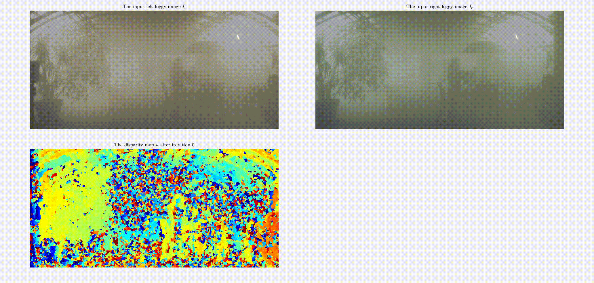

# Variational Simultaneous Stereo Matching and Defogging in Low Visibility
This repository stores the MATLAB implementation of the method described in
> **Variational Simultaneous Stereo Matching and Defogging in Low Visibility**
>
> [Yining (Ted) Ding](https://www.edinburgh-robotics.org/students/ted-ding), 
> [Andrew Wallace](https://home.eps.hw.ac.uk//~ceeamw/andy.html) and 
> [Sen Wang](https://www.imperial.ac.uk/people/sen.wang)
>
> LINK TO THE PAPER TO COME



If you find our work useful in your research please consider citing our paper:
```
@inproceedings{ding2022variational,
    title = {Variational Simultaneous Stereo Matching and Defogging in Low Visibility},
    author = {Ding, Yining and Wallace, Andrew and Wang, Sen},
    booktitle = {BMVC},
    year = {2022}
}
```

## Environment
The code was lastly tested in MATLAB R2022a on a laptop (running Ubuntu 22.04) equiped with a dedicated NVIDIA GPU that is supported by MATLAB.
Please check [MATLAB's GPU Computing Requirements](https://uk.mathworks.com/help/parallel-computing/gpu-computing-requirements.html).

## Directory Stucture
```
├── classes
├── data/pad
├── util
└── demo.m
```
- `classes` stores various MATLAB class definitions.
- `data/pad` is to store the data needed (see [Prepare data](#prepare-data)).
- `util` stores various MATLAB functions.
- `demo.m` is a MATLAB script that you are able to run to test our method on a sample scene.

## Usage
### Prepare data
1. Download the [Pixel Accurate Depth Benchmark](https://www.uni-ulm.de/en/in/driveu/projects/dense-datasets#c811604) and unzip it.
2. Unzip the following: `intermetric_rgb_left.zip`, `rgb_left_8bit.zip` and `rgb_right_8bit.zip`. You can unzip others but only these three are needed by our code.
3. Copy directories `intermetric_rgb_left` (dense ground truth depth data), `rgb_left_8bit` (left intensity images) and `rgb_right_8bit` (right intensity images), and paste them to `data/pad`.
4. Load each `.npz` file in `data/pad/intermetric_rgb_left` and save it as a `.mat` file which can be loaded in MATLAB. The python code below should do the job. You can then manually delete all `.npz` files if you wish.
```python
import os
import glob

import numpy as np
from scipy.io import savemat


npz_files = glob.glob("data/pad/intermetric_rgb_left/*.npz")    # you may need to adjust this path
for npz_file in npz_files:
    mat_file = os.path.splitext(npz_file)[0] + '.mat'
    data = np.load(npz_file)
    savemat(mat_file, data)
    print(f'generated {mat_file} from {npz_file}')
```

### Run our method
Simply run `demo.m`. 
This will apply our method to a sample scene.
In your MATLAB workspace you will find variables including a dense disparity map, a defogged intensity image and various metrics.
You can try out other scenes, samples and visibilites.

## Acknowledgements
Some of the code is replicated or adapted from the following repositories.
We thank the authors for making their code open source.
> [fog_simulation-SFSU_synthetic](https://github.com/sakaridis/fog_simulation-SFSU_synthetic) by Christos Sakaridis
> 
> [non-local-dehazing](https://github.com/danaberman/non-local-dehazing) by Dana Berman
>
> [tofmark](https://github.com/RobVisLab/tofmark) by David Ferstl
> 
> [PixelAccurateDepthBenchmark](PixelAccurateDepthBenchmark) by Tobias Gruber